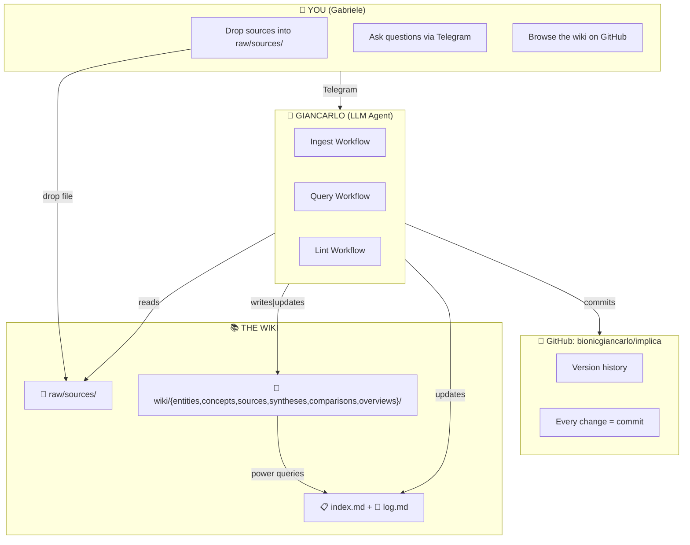

# Gabriele's Wiki

A personal knowledge base, maintained by Giancarlo (LLM).

## What is this?

A persistent, compounding wiki — a structured collection of markdown files that sits between raw sources and answers. When sources are ingested, the wiki is updated. When you ask questions, the wiki is queried. Knowledge compounds rather than being rediscovered.

## System Architecture



## Structure

```
implica/
├── wiki/                   # LLM-generated pages
│   ├── entities/          # Specific things (GPT-4, ChatGPT, people...)
│   ├── concepts/          # Abstract ideas (reasoning, attention, OOD...)
│   ├── sources/           # Per-source summaries
│   ├── syntheses/         # Cross-source synthesis
│   ├── comparisons/       # Side-by-side comparisons
│   └── overviews/         # Broad topic overviews
├── raw/sources/           # Immutable source documents
├── schema.md              # Conventions and workflows
├── index.md               # Content catalog
├── log.md                 # Chronological record
└── diagram.md             # Architecture diagram
```

## How to Use

### Ingest a source
Drop a paper, article, or notes into `raw/sources/` and say:
> "Ingest the source at `raw/sources/my-paper.md`"

Giancarlo will:
- Read the source
- Create a summary page
- Create/update entity and concept pages
- Cross-reference everything
- Update index and log
- Git commit

### Ask a question
> "What do we know about OOD generalization?"
> "Compare GPT-4 and ChatGPT on reasoning"
> "What gaps do we have in our LLM knowledge?"

Giancarlo searches the wiki and synthesizes with citations. Good answers get filed as new wiki pages.

### Lint the wiki
> "Lint the wiki"

Giancarlo checks for: orphan pages, contradictions, stale claims, missing cross-references.

## Why This Works

The tedious part of maintaining a knowledge base isn't reading or thinking — it's the bookkeeping. Humans abandon wikis because maintenance burden grows faster than value. LLMs don't get bored, don't forget, can touch 15 files at once. Maintenance cost ≈ zero → wiki stays alive and compounds.

## Recent Activity

See [[log.md]] for the full timeline.

---

*Wiki initialized: 2026-04-05 | Maintained by Giancarlo 🧠*
