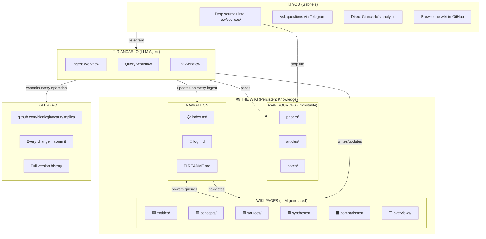

# LLM Wiki System Architecture



## Operations

### INGEST
```
You drop source → Giancarlo reads → Creates summary + entities + concepts → Updates index → Logs operation → Git commit
```

### QUERY
```
You ask → Giancarlo reads index → Finds relevant pages → Synthesizes answer with citations → Files valuable answers as new wiki pages
```

### LINT
```
You say "Lint" → Giancarlo checks: orphans, contradictions, stale claims, missing links → Reports + fixes
```

## Why This Works

| Human | LLM |
|-------|-----|
| Curation & questions | Reading, summarizing, cross-referencing |
| Meaning & direction | Filing, updating, maintaining |
| Asks good questions | Does all the bookkeeping |
| Thinks about implications | Keeps wiki consistent & current |

**Key insight:** Humans abandon wikis because maintenance burden > value as it grows. LLMs don't get bored or forget. Maintenance cost ≈ zero → wiki compounds forever.

---

*Built with Giancarlo 🧠 | 2026-04-05*
